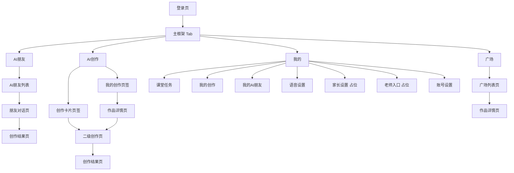

# AI课堂一期前端原型版 PRD

## 1. 文档信息

- 产品名称：AI课堂
- 文档类型：一期前端原型版 PRD
- 版本：V1.0
- 日期：2026-06-26
- 适用范围：iOS 原生项目优先，界面结构同时兼容 iPad、手机端和网页端课堂载体
- 一期目标：先完成前端页面、页面之间的交互和跳转逻辑，使用假数据驱动演示，不接真实接口

## 2. 项目背景

AI课堂是一个面向青少年的 AI 学习与创作平台。产品以 iPad 端和网页端作为主要课堂载体，手机端保持相同功能并根据屏幕尺寸自适应显示。用户核心任务不是传统聊天，而是围绕不同 AI 伙伴进入故事、音乐、图画、动画、游戏、报告等创作场景，完成作品生成、查看、保存、发布和浏览互动。

一期不追求后端闭环，重点验证以下内容：

1. 首页信息架构是否清晰。
2. 学生是否能快速理解“AI朋友”和“AI创作”的区别。
3. 创作链路是否顺畅，能否从入口自然走到“生成结果”和“我的创作”。
4. 广场和我的页面是否能形成完整的浏览、回看、继续创作路径。
5. iPad、手机和网页端在同一套信息架构下是否具备可扩展性。

## 3. 一期目标与非目标

### 3.1 一期目标

1. 完成登录、AI朋友、AI创作、广场、我的五大模块的前端页面。
2. 完成核心页面之间的导航、跳转、返回、筛选、切换、发布确认等交互。
3. 使用假数据构建完整原型，使课堂演示时可覆盖主要用户路径。
4. 输出统一的页面状态规范，包括默认态、空态、加载态、结果态、发布态。
5. 为后续接接口保留清晰的页面结构与状态占位。

### 3.2 一期非目标

1. 不接入真实登录、短信验证码服务。
2. 不实现真实 AI 生成能力，不调用大模型或多媒体生成接口。
3. 不实现真实作品审核、点赞、评分、排序算法。
4. 不实现完整的老师端、家长端业务流程，仅保留入口和占位页。
5. 不处理支付、会员、成长体系、消息通知、班级管理等复杂业务。

## 4. 目标用户与使用场景

### 4.1 目标用户

- 主用户：学生
- 次级相关角色：家长、老师

### 4.2 一期聚焦用户

一期以学生端主线为核心，家长设置和老师入口仅展示入口和占位页面，不展开复杂流程。

### 4.3 典型使用场景

1. 学生用家长手机号登录后，进入首页，选择一个 AI 朋友开始创作。
2. 学生从 AI 创作页选择故事卡或图画卡，进入二级创作页完成一次创作。
3. 学生在“我的创作”中查看已生成作品，继续编辑或发布到广场。
4. 学生进入广场查看公开作品，按类别筛选、点赞、评分、按热度排序。
5. 学生进入“我的”查看课堂任务、语音设置、账号设置，并从老师入口/家长设置看到后续能力占位。

## 5. 产品定位与设计原则

### 5.1 产品定位

一个适合青少年的 AI 学习与创作平台，强调“低门槛进入、多类型创作、作品可分享、课堂可承载”。

### 5.2 一期设计原则

1. 低龄友好：命名直观、图标形象、操作路径短。
2. 创作导向：首页优先突出“开始创作”，弱化复杂设置。
3. 结果可见：每条创作链路都要有清晰的结果页和保存结果。
4. 状态明确：假数据也要体现加载、空态、成功态、发布态。
5. 多端一致：核心信息架构一致，布局按设备宽度自适应。

## 6. 信息架构

### 6.1 顶层结构

登录成功后进入主框架，采用底部 Tab 导航。

- AI朋友
- AI创作
- 广场
- 我的

### 6.2 页面树

## 7. 核心用户路径

### 7.1 主路径一：登录后通过 AI朋友进入创作

1. 登录页输入家长手机号。
2. 点击“获取验证码”。
3. 输入验证码后点击“进入课堂”。
4. 进入 AI朋友 页面。
5. 点击任意朋友卡片。
6. 进入对话页，查看欢迎语和推荐创作快捷入口。
7. 点击“创作故事/创作音乐/创作图画/创作视频”等动作。
8. 进入对应结果页，展示生成结果。
9. 可执行“再来一次”“保存到我的创作”“发布到广场”。

### 7.2 主路径二：通过 AI创作完成一次标准创作

1. 进入 AI创作。
2. 默认展示“创作卡片”页签。
3. 点击故事卡/图画卡/音乐卡/动画卡/游戏卡/报告卡。
4. 进入对应二级创作页。
5. 填写或选择创作参数。
6. 点击“开始创作”。
7. 进入结果页。
8. 执行保存、继续编辑或发布。

### 7.3 主路径三：查看和管理已有创作

1. 进入 AI创作。
2. 切换到“我的创作”页签。
3. 浏览作品卡片。
4. 点击进入作品详情。
5. 执行“继续编辑”“再次生成”“发布到广场”“删除”。

### 7.4 主路径四：浏览广场内容

1. 进入广场。
2. 查看推荐作品流。
3. 按分类筛选故事、图画、音乐、动画、游戏、报告。
4. 选择排序方式，如默认推荐/热度优先。
5. 进入作品详情。
6. 点赞、评分、查看作者和作品简介。

## 8. 页面需求明细

## 8.1 登录页

### 页面目标

完成学生进入产品的第一步，以“家长手机号 + 验证码”作为统一入口。

### 页面元素

- Logo / 产品名
- 欢迎标题和简短引导文案
- 家长手机号输入框
- 获取验证码按钮
- 验证码输入框
- 进入课堂按钮
- 用户协议/隐私说明入口

### 关键交互

1. 手机号未输入时，“获取验证码”按钮禁用。
2. 手机号格式错误时，输入框下方显示提示文案。
3. 点击“获取验证码”后按钮进入倒计时状态，显示如“59s 后重试”。
4. 验证码输入满足长度后，“进入课堂”按钮高亮可点击。
5. 点击“进入课堂”后默认登录成功，跳转到 AI朋友 页面。

### 原型说明

- 一期不接短信服务。
- 可使用固定验证码，如 `123456`。
- 可增加“游客演示入口”作为开发期辅助开关，但正式原型默认隐藏。

## 8.2 AI朋友页

### 页面目标

用具象化的官方 AI 朋友降低理解门槛，让学生从“伙伴”视角进入创作。

### 页面结构

- 顶部标题区：AI朋友
- 推荐说明文案
- 朋友卡片网格/列表

### 卡片内容

- 头像/插画
- 名称
- 一句话介绍
- 标签，如“会讲故事”“会编音乐”“会做实验”

### 首批卡片

- 故事伙伴
- 音乐伙伴
- 科学伙伴
- 画画伙伴
- 游戏伙伴
- 探索伙伴

### 关键交互

1. 点击卡片进入对应朋友对话页。
2. 卡片支持已使用状态展示，如“最近聊过”。
3. iPad 和网页端使用多列卡片布局，手机端降为双列或单列。

## 8.3 AI朋友对话页

### 页面目标

通过轻量聊天界面承接朋友人格和创作引导，不追求完整聊天系统，一期重点是从“对话”跳到“创作”。

### 页面结构

- 顶部返回
- 朋友头像、名称、状态
- 对话消息流
- 快捷创作按钮区
- 底部输入框和发送按钮

### 假数据策略

- 预置 3 至 5 条朋友欢迎消息。
- 预置推荐创作方向，如“帮我写一个睡前故事”“给我一首太空主题音乐”。

### 关键交互

1. 点击快捷问题，自动插入一条用户消息并刷新一条 AI 回复。
2. 点击“创作故事/创作音乐/创作图画/创作视频”快捷按钮，跳转到对应结果页或对应创作页。
3. 输入框发送后，不必调用真实 AI，可回显假消息。
4. 页面右上可提供“切换朋友”或“更多”入口，初期可不展开。

### 一期边界

- 不做多轮上下文记忆。
- 不做语音输入。
- 不做复杂工具栏。

## 8.4 AI创作页

### 页面目标

让学生明确看到“我可以做什么”和“我做过什么”。

### 页面结构

- 顶部标题：AI创作
- 双页签：
  - 创作卡片
  - 我的创作

## 8.4.1 创作卡片页签

### 卡片类型

- 故事卡
- 图画卡
- 音乐卡
- 动画卡
- 游戏卡
- 报告卡

### 卡片字段

- 图标
- 名称
- 一句话说明
- 适合年龄/课堂主题标签（可选）

### 关键交互

1. 点击任一卡片，进入对应二级创作页。
2. 支持卡片推荐标识，如“今天推荐”“课堂常用”。

## 8.4.2 我的创作页签

### 页面内容

- 作品列表
- 搜索或筛选占位
- 作品状态标签

### 作品状态

- 草稿
- 已保存
- 已发布

### 关键交互

1. 点击作品进入作品详情页。
2. 支持按类别筛选。
3. 空态时引导去“创作卡片”开始第一次创作。

## 8.5 二级创作页

### 页面目标

承接不同类型创作的参数输入，是一期最重要的操作页。

### 通用结构

- 顶部返回
- 页面标题
- 创作说明
- 输入区
- 选项区
- 开始创作按钮

### 各类型最小化字段建议

#### 故事卡

- 故事主题输入
- 主角选择/输入
- 风格选择：温暖、冒险、搞笑、科幻
- 篇幅选择：短篇、中篇

#### 图画卡

- 画面主题输入
- 风格选择：卡通、水彩、像素、幻想
- 色彩倾向选择

#### 音乐卡

- 音乐主题输入
- 情绪选择：快乐、安静、勇敢、神秘
- 时长选择：15 秒、30 秒、60 秒

#### 动画卡

- 动画主题输入
- 主角设定
- 风格选择

#### 游戏卡

- 游戏主题输入
- 类型选择：闯关、问答、冒险

#### 报告卡

- 报告主题输入
- 年级选择
- 输出形式选择：图文摘要、课堂汇报

### 关键交互

1. 必填项满足后，“开始创作”按钮可点击。
2. 点击“开始创作”后进入加载过渡，再跳结果页。
3. 未填写时给出轻提示，不使用复杂报错。

## 8.6 创作结果页

### 页面目标

让用户看到“我已经完成了一次创作”，并引导后续行为。

### 页面结构

- 结果预览区
- 标题和简介
- 创作参数摘要
- 操作按钮区

### 按类型展示建议

- 故事：封面 + 标题 + 正文摘要
- 图画：大图预览
- 音乐：封面 + 播放控件假态
- 动画：封面帧 + 播放占位
- 游戏：封面 + 简介 + 试玩按钮占位
- 报告：封面 + 章节概览

### 关键交互

1. 保存到我的创作。
2. 再来一次。
3. 继续编辑。
4. 发布到广场。
5. 返回首页/返回创作。

### 发布交互

1. 点击“发布到广场”弹出确认弹层。
2. 确认后作品状态更新为“已发布”。
3. 一期不做真实审核，使用文案模拟“已提交，待审核/已发布成功”两种演示状态。

## 8.7 广场页

### 页面目标

承接公开作品浏览和互动，体现平台内容氛围。

### 页面结构

- 顶部标题
- 分类筛选栏
- 排序栏
- 作品瀑布流/双列卡片流

### 分类

- 全部
- 故事
- 图画
- 音乐
- 动画
- 游戏
- 报告

### 排序

- 默认推荐
- 热度优先

### 卡片内容

- 封面
- 标题
- 作者昵称
- 点赞数
- 评分
- 类别标签

### 关键交互

1. 点击分类立即刷新列表。
2. 点击排序方式切换当前结果顺序。
3. 点击卡片进入作品详情。
4. 支持点赞和评分的前端即时反馈。

## 8.8 广场作品详情页

### 页面内容

- 作品主展示区
- 标题
- 作者信息
- 作品介绍
- 点赞按钮
- 评分组件
- 相关推荐列表

### 关键交互

1. 点赞后数量即时 +1，再次点击可取消。
2. 评分后展示当前用户评分结果。
3. 若作品来自自己，可显示“查看我的原作”或“继续编辑”入口。

## 8.9 我的页

### 页面目标

提供学生个人中心与常用功能入口。

### 页面结构

- 顶部用户信息卡
- 功能列表

### 一级入口

- 课堂任务
- 我的创作
- 我的 AI 朋友
- 语音设置
- 家长设置
- 老师入口
- 账号设置

## 8.9.1 课堂任务

### 页面内容

- 任务列表
- 任务状态：未开始、进行中、已完成
- 每个任务可带推荐创作入口

### 关键交互

1. 点击任务进入任务详情占位页。
2. 点击“去完成”可跳转到对应创作卡或朋友页。

## 8.9.2 我的创作

与 AI创作 下的“我的创作”保持内容一致，可复用同一套组件和数据结构。

## 8.9.3 我的 AI 朋友

### 页面目标

展示最近互动过的官方 AI 朋友，形成回访路径。

### 关键交互

1. 点击任一朋友进入该朋友对话页。
2. 可展示最近使用时间和最近一次创作类型。

## 8.9.4 语音设置

### 页面内容

- 播报开关
- 语速选择
- 音色选择

### 一期要求

仅做前端开关和选项态，不接真实语音引擎。

## 8.9.5 家长设置

### 一期定位

占位页。

### 页面内容

- 标题
- 能力说明
- 文案：后续将支持使用时长、创作记录、内容偏好等家长管理功能

## 8.9.6 老师入口

### 一期定位

占位页。

### 页面内容

- 标题
- 能力说明
- 文案：后续将支持课堂任务布置、作品查看、课堂数据面板等教师功能

## 8.9.7 账号设置

### 页面内容

- 当前手机号展示
- 退出登录
- 协议与隐私入口

## 9. 页面跳转与导航规则

### 9.1 导航规则

1. 登录成功后进入主 Tab。
2. 主 Tab 切换保留各自页面滚动位置和当前筛选状态。
3. 二级页统一使用导航栏返回上一页。
4. 从结果页保存后，默认可返回来源页，也可跳“我的创作”。

### 9.2 关键跳转矩阵

| 来源页 | 操作 | 目标页 |
| --- | --- | --- |
| 登录页 | 登录成功 | AI朋友 |
| AI朋友 | 点击朋友卡片 | 朋友对话页 |
| 朋友对话页 | 点击创作快捷入口 | 对应结果页或二级创作页 |
| AI创作-创作卡片 | 点击卡片 | 对应二级创作页 |
| 二级创作页 | 点击开始创作 | 创作结果页 |
| 创作结果页 | 保存到我的创作 | AI创作-我的创作 |
| 创作结果页 | 发布到广场 | 发布确认弹层/发布成功态 |
| AI创作-我的创作 | 点击作品 | 作品详情页 |
| 广场列表 | 点击作品卡片 | 广场作品详情页 |
| 我的-课堂任务 | 点击去完成 | 对应创作页或朋友页 |
| 我的-我的AI朋友 | 点击朋友 | 朋友对话页 |

## 10. 页面状态设计

一期虽然使用假数据，但必须完整体现页面状态，避免后续接接口时结构返工。

### 10.1 通用状态

- 默认态
- 加载态
- 空态
- 成功态
- 失败态

### 10.2 重点页面状态

#### 登录页

- 获取验证码前
- 获取验证码倒计时中
- 输入错误提示态

#### 我的创作

- 有作品列表态
- 空态：还没有作品，去创作第一份作品

#### 广场

- 默认推荐态
- 分类筛选态
- 无结果空态

#### 创作结果页

- 生成中加载态
- 生成成功态
- 生成失败占位态

## 11. 假数据与原型演示要求

### 11.1 假数据原则

1. 每个主要列表页都必须有假数据。
2. 每个类别至少准备 3 至 6 条示例内容。
3. 同一作品数据需在“我的创作”和“广场”中可复用，但通过状态区分是否公开。

### 11.2 建议假数据对象

- 用户信息
- AI朋友数据
- 创作卡片配置
- 作品数据
- 广场作品数据
- 课堂任务数据
- 语音设置选项数据

### 11.3 演示建议

1. 预置 1 名学生账号。
2. 预置 6 个 AI朋友。
3. 预置 10 至 20 个广场作品。
4. 预置 8 至 12 个我的创作作品，覆盖草稿、已保存、已发布三种状态。

## 12. 多端适配要求

### 12.1 iPad 端

- 优先作为课堂展示主端。
- 卡片采用更宽松布局。
- 广场和创作页可使用双列或三列。

### 12.2 手机端

- 保留与 iPad 一致的信息架构。
- 以单列和双列卡片为主。
- 底部 Tab 固定显示，按钮触达区域需足够大。

### 12.3 网页端

- 结构与 iPad 端一致。
- 页面宽度允许内容居中，左右留白更大。
- 需要考虑横向空间利用，提升列表信息密度。

## 13. 视觉与交互方向

### 13.1 视觉关键词

- 低龄友好
- 明亮
- 有创造力
- 安全感
- 课堂可用

### 13.2 组件风格建议

1. 卡片化设计作为主视觉语言。
2. 图标和插画偏具象化，不使用过于成人化的极简样式。
3. 主要操作按钮尽量使用明确动词，如“开始创作”“保存作品”“发布到广场”。
4. 颜色系统区分功能类型，如故事、图画、音乐等可有各自辅助色。

### 13.3 交互原则

1. 核心页面主按钮始终只有一个最强动作。
2. 轻量反馈优先，避免复杂弹窗打断。
3. 每次操作都要有明确结果反馈。

## 14. 一期验收标准

### 14.1 功能验收

1. 五大模块页面已完成。
2. 所有一级页可进入，核心二级页可完整跳转。
3. 登录、进入创作、生成结果、保存作品、发布广场、浏览广场这六条主路径可走通。
4. 家长设置和老师入口有明确占位页面。
5. 假数据完整覆盖主要状态。

### 14.2 体验验收

1. 学生首次进入后，可在 10 秒内理解主要入口。
2. 学生从任一创作入口进入后，可在 3 步内到达结果页。
3. 广场的分类和排序交互具备即时反馈。
4. 我的页面能清晰承载个人内容和设置入口。

## 15. 开发建议

### 15.1 推荐前端实现拆分

1. 先搭主 Tab 框架和导航。
2. 再完成登录和 AI朋友 主路径。
3. 再完成 AI创作 和结果页复用结构。
4. 最后补齐广场、我的和占位页。

### 15.2 推荐组件抽象

- 通用卡片组件
- 作品卡片组件
- 筛选栏组件
- 排序栏组件
- 空态组件
- 发布确认弹层
- 朋友头像信息头部组件

## 16. 后续二期可扩展方向

1. 接入真实短信登录。
2. 接入真实 AI 生成能力。
3. 完整审核流和发布流。
4. 家长设置详细能力。
5. 老师入口与课堂任务联动。
6. 评论、收藏、成长记录等社区能力。

## 17. 总结

一期 PRD 的核心不是把所有业务做完，而是用一套清晰、低门槛、可演示的前端原型验证产品主路径。产品主线定义为：学生登录后，通过 AI朋友 或 AI创作进入创作，完成结果生成，将作品保存到“我的创作”，再进一步发布到广场，并可在“我的”中回看个人内容和课堂入口。只要这个闭环顺畅，一期目标就达成。
